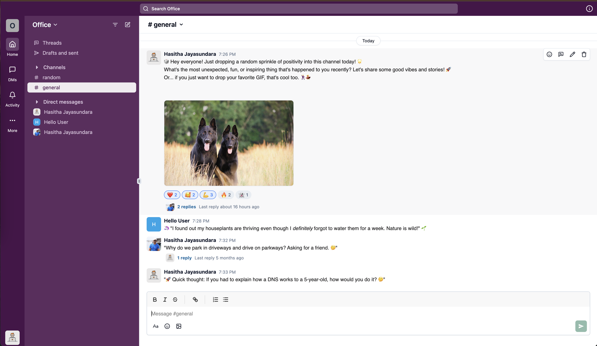

# slack-clone

A simplified clone of Slack, developed using modern web technologies.



## Technologies Used

- **Next.js**: React framework for server-side rendering and static site generation.
- **Tailwind CSS**: Utility-first CSS framework for styling.
- **Shadcn UI**: Component library for building accessible web applications.
- **Convex**: Backend platform for data storage and real-time updates.

## 🚀 How to Run

Follow these steps to set up and run the Slack Clone locally on your machine:

### Clone the Repository
```bash
git clone https://github.com/hasithajayasundara/slack-clone.git
cd slack-clone

npm install
npx convex dev
npm run dev
```
